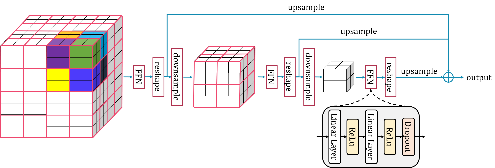
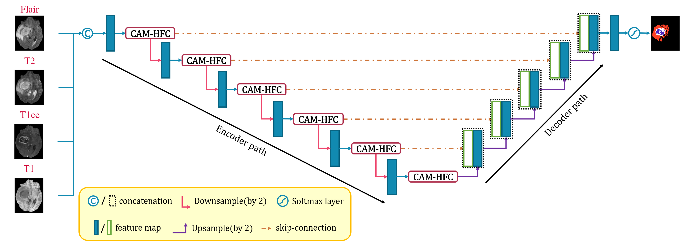

# H-FC

This is the source code of paper "Learning Global Dependencies Based on Hierarchical Full Connection for Brain Tumor Segmentation".

## An example of a hierarchical fully connected module



## Model structure diagram

### Schematic diagram of 3DUNet+SE+HFC


### Schematic diagram of 3DUNet+CAM-HFC



## Experiment Results


Visualized results of nnU-Net, 3DUNet+SE+AG and 3DUNet+SE+HFC. (a) Ground-truth; (b) nnU-Net; (c)
3DUNet+SE+AG; (d) 3DUNet+SE+HFC. We circle the differences with orange dotted lines. The left four columns are the ground-truth and segmentation results, shown as overlay on the T1ce image. The right four columns are the corresponding four
modalities original images.


Visualized results of nnU-Net, 3DUNet+CBAM and 3DUNet+CAM-HFC. (a) Ground-truth; (b) nnU-Net; (e)
3DUNet+CBAM; (f) 3DUNet+CAM-HFC. We circle the differences with orange dotted lines. The left three columns are the ground-truth and segmentation results, shown as overlay on the T1ce image. The right four columns are the corresponding four
modalities original images.

## Preprocessing

Datasets format conversion and preprocessing see https://github.com/MIC-DKFZ/nnUNet.

## Training

Please read the documentation of [nnUNet ](https://github.com/MIC-DKFZ/nnUNet) carefully before training and prediction.

```python
# 3DUNet+SE+AG
CUDA_VISIBLE_DEVICES=0 nnUNet_train 3d_fullres se_ag_TrainerV2 82 0

# 3DUNet+SE+HFC w/ region size = 2
CUDA_VISIBLE_DEVICES=0 nnUNet_train 3d_fullres se_hfc_rs2_TrainerV2 82 0

# 3DUNet+SE+HFC w/ region size = 2 & reducing steps
CUDA_VISIBLE_DEVICES=0 nnUNet_train 3d_fullres se_hfc_rs2_stepReduce_TrainerV2 82 0

# 3DUNet+SE+H-FC-AG w/ region size = 2 & apply H-FC to high-level feature maps only
CUDA_VISIBLE_DEVICES=0 nnUNet_train 3d_fullres se_hfc_rs2_highOnly_TrainerV2 82 0

# 3DUNet+SE+HFC w/ region size = 4
CUDA_VISIBLE_DEVICES=0 nnUNet_train 3d_fullres se_hfc_rs4_TrainerV2 82 0

# 3DUNet+SE+HFC w/ region size = 8
CUDA_VISIBLE_DEVICES=0 nnUNet_train 3d_fullres se_hfc_rs8_TrainerV2 82 0
```

```python
# 3DUNet+CBAM
CUDA_VISIBLE_DEVICES=0 nnUNet_train 3d_fullres cbam_TrainerV2 82 0

# 3DUNet+CAM-HFC w/ region size = 2
CUDA_VISIBLE_DEVICES=0 nnUNet_train 3d_fullres cam_hfc_rs2_TrainerV2 82 0

# 3DUNet+H-FC-CBAM w/ region size = 2 & reducing steps
CUDA_VISIBLE_DEVICES=0 nnUNet_train 3d_fullres cam_hfc_rs2_stepReduce_TrainerV2 82 0

# 3DUNet+H-FC-CBAM w/ region size = 2 & apply H-FC to high-level feature maps only
CUDA_VISIBLE_DEVICES=0 nnUNet_train 3d_fullres cam_hfc_rs2_highOnly_TrainerV2 82 0

# 3DUNet+H-FC-CBAM w/ region size = 4
CUDA_VISIBLE_DEVICES=0 nnUNet_train 3d_fullres cam_hfc_rs4_TrainerV2 82 0

# 3DUNet+H-FC-CBAM w/ region size = 8
CUDA_VISIBLE_DEVICES=0 nnUNet_train 3d_fullres cam_hfc_rs8_TrainerV2 82 0
```

## Prediction

```python
CUDA_VISIBLE_DEVICES=0 nnUNet_predict -i /home/data1/hezhe/nnUNet/nnUNet_raw/nnUNet_raw_data/Task082_BraTS2020/imagesVal/ -o output_dir -t 82 -tr trainer_name -m 3d_fullres -f 0 -chk model_latest
```

